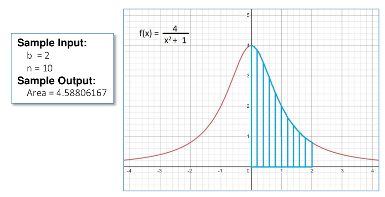

# MEEPS
We're integrating an innocent function. Don't mind us.

### Description (From the instructor)
Numerical integration is widely employed to calculate the numerical value of a definite integral. One engineering application of numerical integration is to approximate the area bounded by a curve and lines.
In this project, you have to develop an algorithm (or technique) to approximate the area between the curve defined by the function f(x), the x-axis, and the two lines x = 0 and x = b, where b ⁝ 2, 2 ≤ b ≤ 4, i.e. the stripped area in the following figure.

### Requirements

1. Write an MIPS assembly program to calculate the stripped area using any area
approximation methods (e.g. rectangle/trapezoid method, Simpson’s method, etc.).
	* Input:
		* b (as described above)
		* n – the number of small rectangles/trapezoids that shape the stripped area to adjust the accuracy of area calculation, n ⸦ N, 10 ≤ n ≤ 20.
	* Output:
		* The stripped area.
2. Write a report and submit a hard copy that includes:
	* The study on floating-point arithmetic on an MIPS computer.
	* The proposed algorithm/implementation and analysis in the state of the MIPS computer (e.g. the state of memory and registers).

## What We Are Going To Do:

### Our goals

1. To extends the constraints of b and n. 
	* 2 ≤ b ≤ 1.000.000.000
	* n ⸦ N, 10 ≤ n ≤ 1.000.000.000
	* (We may not be able to reach 1 billion, but that's the limit we strive to achieve.)

2. Comparing the results of different approaches:
	* Calculate directly using Newton-Leibniz theorem (a.k.a. finding anti-derivative) (which involve <a href="https://math.stackexchange.com/questions/29649/why-is-arctanx-x-x3-3x5-5-x7-7-dots">infinite series for arctan(x)</a>). <b>(Should we do this?)</b>
	* Naively integrate the function as-is
	* Rewrite the denominator as <b>(x+1)^2 - 2x</b>
	* <i>Maybe we'll have another one here, after the morning meeting</i>
	* Using a third-party calculator (Vinacal, Casio, Internet!, ...) for <i>reference</i> (which means, absolute error <i>(ulps)</i> and relative error <i>(epsilon)</i> of all above approaches will be based on the result of this final one. <b>(How to convert the result of third-party applications into our double-precision registers? To check stuffs?)</b>
	
For insights about floating point number, <a href="https://docs.oracle.com/cd/E19957-01/806-3568/ncg_goldberg.html#9921">this paper</a> describes in great details about cancellations, rounding, and much more. 

### What sorcery exists in our MIPS file.
This section describes the components (functions?) of our Mips program: 

1. NEWTON\_LEIBNIZ: 
Calculate our Integration with Newton-Leibniz theorem.
<i>(Psst! The result is 4.arctan(b))</i>
	* @param  $a0: b Right bound of integration
	* @param  $a1: n. The number of terms this series contains (put it simply, accuracy)
	* @return $f?: The double-precision result of calculation.

2. NAIVE:
Calculate our Integration normally like every normal person do.
	* @param  $a0: b. Right bound of integration
	* @param  $a1: n. The number of sample points we'll takes (How many dx?)
	* @return $f?: The double-precision result of calculation.

3. SQUARE:
Rewrite the denominator as (x+1)^2 - 2\*x and then integrate
	* @param  $a0: b. Right bound of integration
	* @param  $a1: n. The number of sample points we'll takes (How many dx?)
	* @return $f?: The double-precision result of calculation.

4. ANNOUNCE:
Print to the console (or screen) in the format:

>The integration using <i>technique</i> yields <i>result</i>
>It's in error by ??? ulps
>With the relative error of ??? eps

And it takes the following arguments:
	* @param  $a0: technique. Pointer to the technique string name (Square, Naive, Newton-Leibniz)
	* @param  $a1: result. The double-precision register holds result calculated by <i>technique</i>	
	* @param  $a2: reference. The double-precision result register calculated by <i>reference</i> (Newton-Leibniz? Vinacal? Casio?)

On how to calculate absolute error <i>ulps</i> and relative error <i>eps</i>, refers to <a href="https://docs.oracle.com/cd/E19957-01/806-3568/ncg_goldberg.html#9921">this paper</a>

5. SOMETHING\_ELSE
<i>which will be discussed in the meeting</i>

### Tips 
1. On coding integrations and series 
Calculate from the smallest terms first, because if you do from the biggest ones, the smaller terms' bits might get shifted into oblivion.

2. Eureka
<i>We'll find out on the go</i> 
