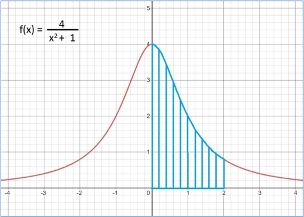
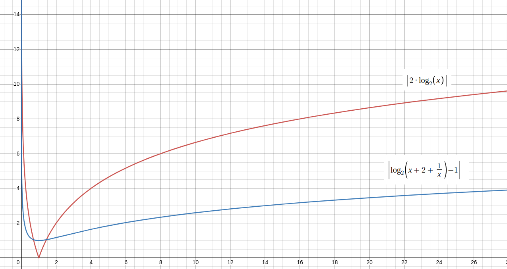
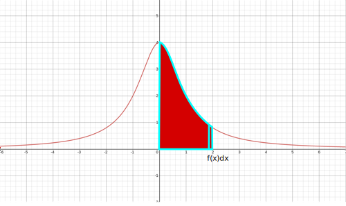
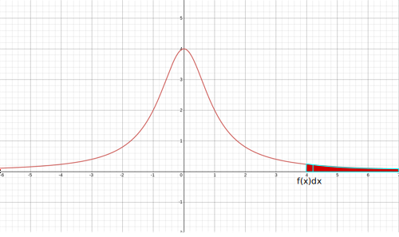
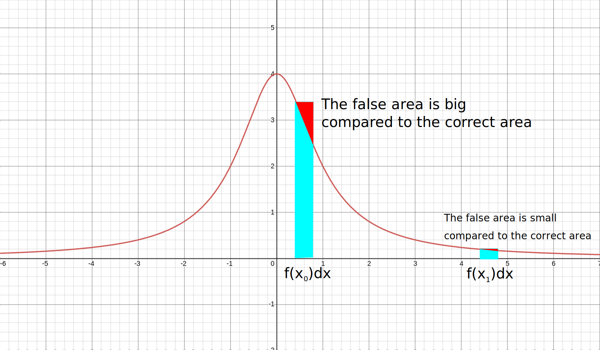
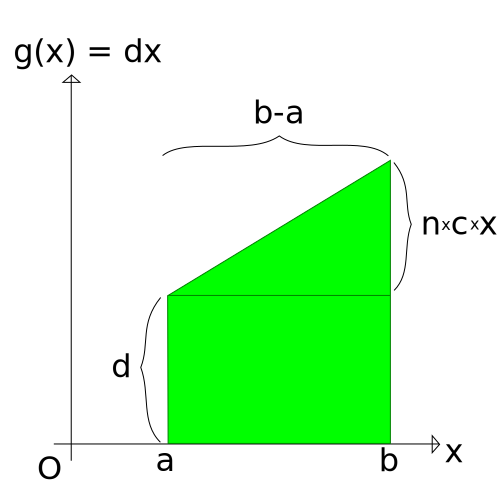

# MIPS - PROPOSED METHODS TO INCREASE INTEGRATION ACCURACY 

#TODO:
Insert comparison result of NAIVE method to Rewriting Function part.

## Abstract
The purpose of this report is to: 
* Describe the method to integrate the function of interest: 4/(x^2+1)
* Describe three methods to increase integration accuracy, including:
	+ Change integrating direction
	+ Rewriting function
	+ Change integrating step (dx)
* Describe what I have learnt about floating point numbers. 

## How Did I Do It?

For reference/illustration/entertainment purpose, this is a snapshot of the Funtion (function):

And to compare the effectiveness of different integrating technique, we'll use the following test cases and reference results from <a href="https://www.integral-calculator.com/">integral-calculator</a>:

* *a* is starting point
* *b* is end point
* *n* is the number of short intervals *dx* from *a* to *b*

<b>Default Cases:</b>

	1. a = 0, b = 2, n = 10 (Example test case)

	integral-calculator: 4.428594871176362

	2. a = 0, b = 4, n = 20 (Project requirement's maximum constraint)

	integral-calculator: 5.30327065467213

<b>Non-trivial:</b>

	3. a = 0, b = 100, n = 10000 

	integral-calculator: 6.243186640432926

<b>Depth of Precision:</b>

	a = 0, b = 1

	4. n = 10

	5. n = 1000

	6. n = 1e5

	integral-calculator: 3.141592653589793

<b>Definition of Impossibility:</b> *in which I failed*

	7. a = 0, b = 1e9, n = 1e5 

	8. a = 0, b = 1e9, n = 1e6

	integral-calculator: 6.283185303179586

 
### Rewriting Function

Consider the denominator of the function, x^2 + 1. There's something wrong with this equation. Let us examine the amount of bits shifted when *x* varies on the axis of real numbers. 
The ratio between two operands is: R0 = x^2/1 = x^2
To align two most significant bits for addition, the lower number must be shifted right: B0 = |log2(x^2)| = 2\*|log2(x)| (bits)
For example, let x=8, addition between 8^2 + 1 = 64 + 1 will require the second operand, 1, to be shifted right 2\*|log2(64)| = 12 bits
With single-precision floating point numbers, 23 bits are used to store the number, plus 1 hidden bit by normalization, we obtain a 24-bit number to work with addition. Although addition between 64 and 1 still yield the correct result of 65, this example shows how dangerous bit-shifting can be. 12 bit shifted into oblivion means a 32-bit floating point has just lost half of its precision in just one simple operation. The effect of precision loss will accumulate over the integration course, as there're many add operations with the same accuracy loss.

I propose a way to lessen this loss as following: Rewriting the denominator from x^2 + 1 to (x+1)^2 - 2\*x. This is better than calculate the denominator directly (which is fast, but inaccurate).
The ratio between two operands is: R1 = (x+1)^2/2x = x/2 + 1 + 1/2x
Thus, the amount of bits shifted for the denominator addition is: B1 = |log2(R1)| = |log2(x/2 + 1 + 1/2x)| = |log2(x + 2 + 1/x) - 1|
To see the accuracy boost, here's a pretty graph for you:

	

I can do a mathematical evaluation here to prove that my rewriting reduces bit-shift amount by half most of the time (most, as in "except nearby 1"). But an image speaks for a thousand words, right?

### Changing Integration Direction
MIPS Architecture conforms to IEEE 754 standards, which means for all types of floating point number (single, single-extended, double, double-extended precision), the first bit is sign bit. Because of the sign bit, flipping the sign bit affects nothing to the precision of the number.
	
Consider the *conventional* direction:
	
	

Integrating from *a* to *b*, when a < b, pose a tiny problem. The term f(x)dx is small compared to the current total sum from *a* to *x*, especially when b becomes large. When adding two floating points, the one that has value closer to zero (f(x)dx) is shifted right to align its most significant bit with its bigger partner (integration sum). 
One way to relieve the negative effect of bits-shifting is reversing the integrating direction:

	

When applied this way, f(x)dx increase in size as its current sum increase, thus less bits are shifted in the process.

Here's the results calculated from each method for comparison. Results with +) are calculated from *a* to *b*, and -) are from *b* to *a* with sign bit flipped.

<b>Default Cases:</b>

        1. a = 0, b = 2, n = 10 (Example test case)

        integral-calculator: 4.428594871176362

	+) 4.746463582946891	| Deviation: 0.31786871177052944

	-) 4.1064635829468905	| Deviation: 0.3221312882294711 

        2. a = 0, b = 4, n = 20 (Project requirement's maximum constraint)

        integral-calculator: 5.30327065467213

	+) 5.679372307145335	| Deviation:  0.3761016524732046

	-) 4.926431130674751	| Deviation:  0.3768395239973792

<b>Non-trivial:</b>

        3. a = 0, b = 100, n = 10000

        integral-calculator: 6.243186640432926

	+) 6.263184640566289	| Deviation:  0.019998000133362837

	-) 6.223188640223301	| Deviation:  0.0199980002096245

<b>Depth of Precision:</b>

        a = 0, b = 1

        4. n = 10

        integral-calculator: 3.141592653589793

	+) 3.239925988907159	| Deviation:  0.0983333353173661

	-) 3.039925988907159	| Deviation:  0.10166666468263408

        5. n = 1000

        integral-calculator: 3.141592653589793

	+) 3.1425924869231214	| Deviation:  0.000999833333328315

	-) 3.1405924869231274	| Deviation:  0.0010001666666656917

        6. n = 1e5

        integral-calculator: 3.141592653589793

	+) 3.141602653573869	| Deviation:  9.999984075914625e-6

	-) 3.1415826535700364	| Deviation:  1.000001975670628e-5

<b>Definition of Impossibility:</b> 

        7. a = 0, b = 1e9, n = 1e5

        integral-calculator: 6.283185303179586

	+) 40000.000657941004	| Deviation: Too big 

	-) 6.579696224299975e-4	| Deviation: Not big but big

        8. a = 0, b = 1e9, n = 1e6

        integral-calculator: 6.283185303179586

	+) 4000.006579706147		| Deviation: Still big	

	-) 0.0065797279381060395	| Deviation: Big

As you can see, the results do not conform to theoretical analysis. To reason this, the deviation increase might be amplified by catastrophic cancellation. Both denominators x^2 + 1 and (x+1)^2 - 2x suffer from catastrophism, but in the original x^2 + 1, only x^2 is subjected to rounding error, while in the latter (x+1)^2 - 2x, both operands have rounding error caused by multiplication. Operand 2\*x might have been the cause of such calamity, the certainty of which I'll never know.

### Change Integration Step
From the graph of the function, we see that the function becomes more and more even as *x* approaches infinity. In contrary, it's pretty slopy when *x* comes to 0. But, wherever *x* might be, dx does not change. That is, the area f(x)dx when *x* is near infinity may be very close to a true rectangle, while f(x)dx near 0 is not.

Dividing dx evenly accidentally add too much false area - the area which does not belong to the graph below function curve when x is near 0 or dx is large (caused by a long range of (a, b) with too few number of trapezoids). 
And thus, the integration process may be more accurate if we do not divide dx evenly like that. The general idea is: if f(x) is slopy at a certain point x, shrink the size of dx to lessen false area, and stretch out dx when f(x) is even. To do this, consider dx as a function of x, namely, dx = g(x), which will varyin amplitude based on how slopy f(x) is. 
So, what is g(x), exactly? I mention twice that g(x) will change based on f(x) slopiness. f(x) slopiness is actually a fancy way to talk about f(x) derivative, f'(x). And since dx and f'(x) are inversed in size, it's naturally to come up with a g(x) like:

g(x) = c/|f'(x)|	(c in R, c > 0)

Another approach I want to discuss (for this project only), is letting dx varies linearly. Since dx gets larger when x becomes large, we find a new function g(i) to capture this association:

dx = g(i) = c\*i + d		(c, d in R; c != 0)
where d is the amplitude of the initial dx
	c is the incremented amount after every term f(x)dx
	i is the sequence term index (0 <= i < n)

The figure below illustrates the idea:

Although they look promising, they are not. You can find my answer to these two methods in the below Appendix. They are not very complete, however. 

## Appendix

At this appendix, questions unanswered are here to relish your thirst... Or to make you crave for more.

### Derivative Inverse method

g(x) = c / |f'(x)|

Let g(x) be a function of x, defines g(x) to be:
dx(x) = c1 / f'(x) when f'(x) != 0
	= c2	when f'(x) = 0 
Where c1, c2 are some constant

dx(x) becomes big when the graph is even
and vice versa, small when the graph is slopy	

There's a problem: the sum of all dx must equals the range b-a
Which means:
integration from a -> b with variable u of dx(u)du = b-a
=> integr(c/f'(u)\*du) = b-a

That's where c comes into play

For this project only, we're able to find c:
c/f'(u) = c/(-8x/(x^2+1)^2)
= -c\*(x^3/8 + x/4 + 1/8x)

Antiderivative of c/f'(u):
-c\*(x^4/4 + x^2 - ln(x))/8 

And since integration from a to b equals b-a:
c\*((a^4-b^4)/4 + a^2-b^2 + ln(a) - ln(b))/8 = b-a
=> c \* ((a-b)(a+b)(a^2 + b^2 + 4)/4 + ln(a/b))/8 = b - a
=> c = 32(b-a) / ((a-b)(a+b)(a^2 + b^2 + 4) + 4\*ln(a/b))

That's one NASTY formula!
At this point, calculating c might have pushed it off the road too far. Errors in ln() can be large, resulting in a value c' differs too much from real c. This make Derivative-Inverse method distasteful to implement and use.

### Linear dx method

Let's start at the beginning:
We let dx varies by a function of i - the i-th term in the integration sequence:

dx = g(i) = c\*i + d		(c, d in R; c != 0)

Call R the ratio between the first and the last dx:
R = g(a)/g(b)
=> R = d/(c(b-a) + d)		(1)

The value for this ratio R will be defined ourselves. If you want dx to increase faster, then increase R.

Because the sum of all dx in the integration process equals the length of interval (a, b):
g(0) + g(1) + g(2) + ... + g(n-1) = b-a
=> d + (c+d) + (2c+d) +...+ (c\*n-c +d) = b-a
=> n\*d + c\*n\*(n-1)/2 = b-a	(2)

With (1) and (2): R, a, b, n known:
R = d/(c(b-a) + d)		(1)
n\*d + c\*n\*(n-1)/2 = b-a	(2)

(1) => d = Rc(b-a)/(1-R)
(2) => d = (b-a)/n - c\*(n-1)/2

=> Rc(b-a)/(1-R) = (b-a)/n - c\*(n-1)/2
=> c(R(b-a)/(1-R) + (n-1)/2) = (b-a)/n
=> c = (b-a) / n(R(b-a)/(1-R) + (n-1)/2)

c = (b-a)2(1-R) / n(2R(b-a) + (n-1)(1-R)) 
c = (b-a)2(1-R) / n(2R(b-a) + (n-1)(1-R) - 2\*(b-a) + 2\*(b-a)) 
c = (b-a)2(1-R) / n(2(R-1)(b-a) + (n-1)(1-R) + 2\*(b-a)) 
c = (b-a)2 / n(2(a-b) + (n-1) + 2\*(b-a)/(1-R)) 
Put S = (b-a)
c = 2S / n(2S(R/(1-R)) + n-1) 
=> d = RcS/(1-R)
	= 2RSS/ n(2SR + (n-1)(1-R))

At this point, I don't even know if I did the equations correctly or not. Even if they do, the equations for c and d suffer from too much cancellation that I bet they won't do us anymore justice than constant dx method.
